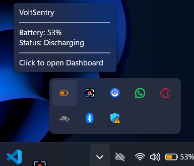

# 🔋 VoltSentry

**Intelligent Battery Health Monitoring & Charge Management for Windows**

VoltSentry is a lightweight Windows desktop application that helps users monitor battery status, configure charging and discharge thresholds, and receive timely alerts to encourage healthier battery usage habits.

---

## 📸 Preview


<p align="center">
  
</p>

<p align="center">
  <em>VoltSentry dashboard showing battery status, health information, and application controls.</em>
</p>

<p align="center">
  
  
</p>

<p align="center">
  <em>Battery threshold notifications.</em>
</p>

---

## 📖 Table of Contents

* [About VoltSentry](#about-voltsentry)
* [The Problem](#the-problem)
* [The Solution](#the-solution)
* [Features](#features)
* [How VoltSentry Works](#how-voltsentry-works)
* [Installation](#installation)
* [Getting Started](#getting-started)
* [Settings](#settings)
* [System Requirements](#system-requirements)
* [Troubleshooting](#troubleshooting)
* [Development](#development)
* [Contributing](#contributing)
* [Reporting Issues](#reporting-issues)
* [Technology Stack](#technology-stack)
* [License](#license)
* [Contact](#contact)

---

## 📌 About VoltSentry

VoltSentry is a **native Windows desktop application** focused on battery monitoring, configurable charge thresholds, and intelligent user notifications.

Instead of requiring users to constantly check the Windows battery indicator, VoltSentry continuously monitors battery status in the background and provides notifications when configured thresholds are reached.

The goal is simple:

> **Give users better visibility and control over their everyday battery charging habits.**

VoltSentry is designed to complement the operating system's existing battery-management capabilities rather than replace the hardware's built-in charging protections.

---

## 🎯 The Problem

Laptop users often leave their devices connected to power for extended periods or allow the battery to become very low before charging.

While modern operating systems and laptop hardware provide built-in battery protections, users may still benefit from:

* Clearer battery-status monitoring
* Configurable charge and discharge thresholds
* Timely notifications
* Battery health information
* Historical battery events
* Background monitoring without keeping the dashboard open

Windows provides basic battery information, but it does not provide the level of customization and user-focused notifications that VoltSentry aims to provide.

---

## 💡 The Solution

VoltSentry provides a centralized battery-monitoring experience with configurable thresholds and notifications.

### Core workflow

1. VoltSentry monitors the current battery state.
2. The application compares the battery level against the user's configured thresholds.
3. When a threshold is reached, VoltSentry generates an appropriate notification.
4. The user can respond by connecting or disconnecting the charger.
5. Battery events can be reviewed through the application.

This makes VoltSentry a **battery-management assistant**, rather than a replacement for the laptop's built-in charging controller.

---

## ✨ Features

| Feature                      | Description                                                                                    |
| ---------------------------- | ---------------------------------------------------------------------------------------------- |
| **Smart Battery Monitoring** | Monitor battery percentage and charging status in real time.                                   |
| **Configurable Thresholds**  | Configure the battery levels at which alerts should be triggered.                              |
| **Dual Alarm System**        | Use different notifications for charging and low-battery events.                               |
| **Persistent Alerts**        | Continue alerting the user until the event is acknowledged or the configured behavior changes. |
| **Windows System Tray**      | Keep VoltSentry running in the background with system-tray integration.                        |
| **Dashboard**                | View battery status, health information, and available controls from a centralized interface.  |
| **Battery Health Tracking**  | Track available battery-health information over time.                                          |
| **Charge Cycle Tracking**    | Monitor available battery cycle information.                                                   |
| **Auto-Start**               | Optionally launch VoltSentry when Windows starts.                                              |
| **Quiet Hours**              | Configure periods during which audible alerts should be suppressed.                            |
| **Snooze Alarms**            | Temporarily silence notifications when required.                                               |
| **Settings Backup**          | Back up and restore application settings.                                                      |
| **Battery History**          | Review recorded battery events and alert activity.                                             |

---

## 🔄 How VoltSentry Works

VoltSentry operates primarily as a background monitoring application.

```text
┌─────────────────────────┐
│      Windows Battery    │
│      Information        │
└────────────┬────────────┘
             │
             ▼
┌─────────────────────────┐
│    VoltSentry Monitor   │
│                         │
│ • Battery Level         │
│ • Charging State        │
│ • Health Information    │
│ • Threshold Evaluation  │
└────────────┬────────────┘
             │
             ▼
┌─────────────────────────┐
│   Threshold Detection   │
└────────────┬────────────┘
             │
       ┌─────┴─────┐
       ▼           ▼
┌────────────┐ ┌────────────┐
│ Low Battery│ │ Charge     │
│ Alert      │ │ Threshold  │
└─────┬──────┘ └─────┬──────┘
      │              │
      └──────┬───────┘
             ▼
┌─────────────────────────┐
│       User Alert        │
│                         │
│ • Notification          │
│ • Sound                 │
│ • System Tray           │
└─────────────────────────┘
```

The exact behavior depends on the thresholds and notification settings configured by the user.

---

## 📥 Installation

### Option 1 — Download the Executable

The recommended way to use VoltSentry is to download the latest Windows executable from the project's releases page.

1. Open the [VoltSentry Releases](https://github.com/sancy1/voltsentry/releases) page.
2. Download the latest release.
3. Launch the executable.
4. Follow the application's initial configuration steps.

> **Note:** VoltSentry is currently designed for Windows.

---

### Option 2 — Run from Source

#### 1. Clone the repository

```bash
git clone https://github.com/sancy1/voltsentry.git
cd voltsentry
```

#### 2. Create a virtual environment

```bash
python -m venv venv
```

#### 3. Activate the virtual environment

**Windows:**

```powershell
venv\Scripts\activate
```

**macOS/Linux:**

```bash
source venv/bin/activate
```

> VoltSentry is currently designed for Windows, so macOS/Linux support may require additional platform-specific work.

#### 4. Install dependencies

```bash
pip install -r requirements.txt
```

#### 5. Run the application

```bash
python -m voltsentry.app
```

---

## 📦 Building from Source

VoltSentry can be packaged into a standalone executable using PyInstaller.

### Install PyInstaller

```bash
pip install pyinstaller
```

### Build the application

```bash
python build_single_exe.py
```

The generated executable should be available under:

```text
dist\VoltSentry.exe
```

---

## 🚀 Getting Started

After launching VoltSentry:

### 1. Open VoltSentry

Launch the application from the executable or your development environment.

### 2. Check the system tray

VoltSentry can operate in the background through the Windows system tray.

### 3. Open the dashboard

Use the system-tray interface to access the main dashboard.

### 4. Configure your thresholds

Open **Settings** and configure the battery levels at which you want to receive notifications.

### 5. Configure notifications

Choose your preferred alarm, notification, snooze, and quiet-hour behavior.

---

## 🖥️ Dashboard

The dashboard provides a centralized view of the application's battery information and controls.

| Section             | Description                                                                       |
| ------------------- | --------------------------------------------------------------------------------- |
| **Battery Level**   | Displays the current battery percentage.                                          |
| **Charging Status** | Shows whether the system is charging, discharging, or in another available state. |
| **Battery Health**  | Displays available battery-health information.                                    |
| **Actions**         | Provides available battery-management actions.                                    |
| **Settings**        | Provides access to application configuration.                                     |
| **Health**          | Displays available battery-health trends.                                         |
| **History**         | Provides access to recorded battery events.                                       |

---

## 🔔 Alert Workflow

A typical configured workflow can look like this:

```text
Battery level reaches configured low threshold
                    │
                    ▼
          VoltSentry notification
                    │
                    ▼
          User connects charger
                    │
                    ▼
      Battery reaches configured charge
                    │
                    ▼
          VoltSentry notification
                    │
                    ▼
       User disconnects charger
```

The exact thresholds are configurable and should be selected according to the user's device, usage pattern, and manufacturer recommendations.

---

## ⚙️ Settings

### Battery Thresholds

VoltSentry allows users to configure the battery levels that trigger notifications.

A commonly used configuration might be:

| Setting                         | Example |
| ------------------------------- | ------: |
| **Charge Alert Threshold**      |     85% |
| **Low Battery Alert Threshold** |     20% |

These values are examples rather than universal requirements. Battery behavior and recommended charging practices can vary between devices and manufacturers.

### Quiet Hours

Quiet Hours can be used to suppress audible alerts during a specified period.

Example:

| Setting                  | Example                                |
| ------------------------ | -------------------------------------- |
| **Quiet Hours**          | Enabled                                |
| **Start**                | 22:00                                  |
| **End**                  | 07:00                                  |
| **Visual Notifications** | Depending on application configuration |

### Auto-Start

When enabled, VoltSentry can launch automatically when Windows starts.

---

## 🔧 System Requirements

| Requirement          | Minimum                         |
| -------------------- | ------------------------------- |
| **Operating System** | Windows 10 / Windows 11         |
| **RAM**              | 256 MB                          |
| **Storage**          | 100 MB                          |
| **Processor**        | Modern x64-compatible processor |

Actual resource usage may vary depending on the application version and configuration.

---

## 🐛 Troubleshooting

### Tray icon is not visible

Check the Windows system-tray overflow menu by selecting the `^` icon near the taskbar notification area.

### No alarm sound

Check:

* Windows system volume.
* Application notification settings.
* Windows Volume Mixer.
* Whether Quiet Hours are enabled.
* Whether the selected notification sound is available.

### VoltSentry does not start

If running from source, launch the application from a terminal so that startup errors are visible.

```bash
python -m voltsentry.app
```

### Auto-start is not working

Check the Windows startup configuration and confirm that VoltSentry has permission to register or use the configured startup mechanism.

### Dashboard does not display correctly

Try:

1. Closing and reopening VoltSentry.
2. Resizing the application window.
3. Checking the application logs.
4. Running the application from a terminal if using the source version.

---

## 📝 Logs

Application logs are stored under the local application-data directory:

```text
%LOCALAPPDATA%\VoltSentry\logs\voltsentry.log
```

When reporting a problem, including relevant log information can make troubleshooting significantly easier.

> Remove sensitive information from logs before sharing them publicly.

---

## 🛠️ Development

### Project Setup

```bash
git clone https://github.com/sancy1/voltsentry.git
cd voltsentry

python -m venv venv
venv\Scripts\activate

pip install -r requirements.txt
```

Run the application:

```bash
python -m voltsentry.app
```

### Build

```bash
pip install pyinstaller
python build_single_exe.py
```

---

## 🤝 Contributing

Contributions, suggestions, and improvements are welcome.

### Contribution Workflow

1. Fork the repository.
2. Clone your fork.
3. Create a feature branch.
4. Make your changes.
5. Test your changes.
6. Commit your work.
7. Push the branch to your fork.
8. Open a Pull Request.

Example:

```bash
git clone https://github.com/YOUR_USERNAME/voltsentry.git
cd voltsentry

git checkout -b feature/your-feature-name

git add .
git commit -m "Add: your feature description"

git push origin feature/your-feature-name
```

Then open a Pull Request from your fork.

### Contribution Guidelines

When contributing:

* Keep changes focused.
* Follow the existing project structure.
* Maintain consistent code style.
* Add or update tests where appropriate.
* Update documentation when behavior changes.
* Avoid committing secrets, credentials, or personal information.

---

## 💡 Areas for Future Development

Potential areas for future development include:

* Additional platform support.
* Expanded battery analytics.
* Improved battery-health history.
* Additional notification customization.
* Localization.
* Additional testing coverage.
* Optional synchronization features.
* Improved predictive battery insights.

---

## 🐞 Reporting Issues

If you encounter a bug or have a feature request, please create an issue on GitHub.

When reporting a bug, include:

* A clear issue title.
* Steps to reproduce the problem.
* Expected behavior.
* Actual behavior.
* Windows version.
* VoltSentry version.
* Relevant screenshots.
* Relevant log information.

### Report an Issue

[Open a VoltSentry Issue](https://github.com/sancy1/voltsentry/issues)

Please avoid posting passwords, API keys, credentials, or other sensitive information in public issues.

---

## 🧰 Technology Stack

VoltSentry is built using Python and a collection of libraries focused on desktop UI, system monitoring, persistence, and application packaging.

| Technology      | Purpose                          |
| --------------- | -------------------------------- |
| **Python**      | Core application language        |
| **PyQt6**       | Desktop graphical user interface |
| **psutil**      | System and battery information   |
| **SQLAlchemy**  | Database and persistence layer   |
| **PyInstaller** | Standalone application packaging |

---

## 📜 License

**Proprietary — All Rights Reserved**

Copyright © 2026 VoltSentry.

The source code and associated materials are provided for the purposes permitted by the repository owner. Redistribution, modification, or commercial use may require explicit permission.

---

## 📬 Contact

For questions, feedback, or project-related communication:

**Developer:** Sancy

**GitHub:** [@sancy1](https://github.com/sancy1)

**Repository:** [github.com/sancy1/voltsentry](https://github.com/sancy1/voltsentry)

**Email:** [sanchez.alexander.cyril@gmail.com](mailto:sanchez.alexander.cyril@gmail.com)

---

## ⭐ Support the Project

If you find VoltSentry useful:

* ⭐ Star the repository.
* 🐞 Report bugs.
* 💡 Suggest improvements.
* 🤝 Contribute to the project.
* 🔗 Share the project with others.

---

## 🙏 Acknowledgments

VoltSentry uses the following open-source technologies:

* **PyQt6** — Desktop graphical user interface
* **psutil** — System and battery information
* **SQLAlchemy** — Database ORM
* **PyInstaller** — Application packaging

---

<p align="center">
  <strong>Built with for smarter battery management.</strong>
</p>

<p align="center">
  <em>VoltSentry — Better visibility. Better battery habits.</em> 🔋
</p>

## 📬 Contact

For questions, feedback, or collaboration:

**Author:** Alexander Sanchez Cyril

- **GitHub:** [@sancy1](https://github.com/sancy1)
- **Email:** sanchez.alexander.cyril@gmail.com
- **Repository:** https://github.com/sancy1/voltsentry
